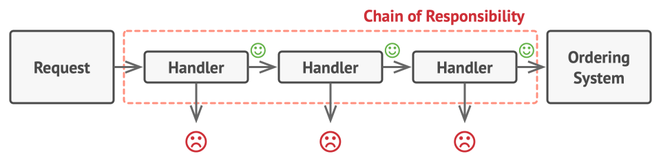

## Chain of Responsability

Like many other behavioral design patterns, the Chain of Responsibility relies on transforming particular behaviors into stand-alone objects called handlers. 

The pattern suggests that you link these handlers into a chain. Each linked handler has a field for storing a reference to the next handler in the chain. In addition to processing a request, handlers pass the request further along the chain. The request travels along the chain until all handlers have had a chance to process it.

It’s crucial that all handler classes implement the same interface. Each concrete handler should only care about the following one having the `execute` method. This way you can compose chains at runtime, using various handlers without coupling your code to their concrete classes.